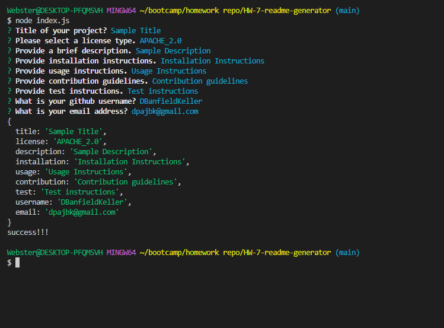

# README Generator

## Description
This project sets out to create a README generator that can be run from the terminal. This program is written in Javascript using node.js. Using the Inquirer npm v 8.2.4, this application collects data from user inputs and automatically formats it into a professional looking README.  

## Table of Contents
 - [Description](#description)
 - [Installation](#installation)
 - [Usage](#usage)
 - [License](#license)
 - [Contributing](#contributing)
 - [Tests](#tests)
 - [Questions](#questions)
 ## Installation
 Clone this repository to the desired location. In order to run this application, in addition to node.js you will need to download the inquirer npm, version 8.2.4. Run the below commands in the root folder to install inquirer.
 ```
 npm init
 npm install inquirer@8.2.4 
 ```
 
 ## Usage
To run this code navigate to the root folder and run the following command
```
node index.js
```
[]

## License
This application is not under any license.

## Contributing
Feel free to submit a pull request.

## Tests
N/A

## Questions
If you have any questions please feel free to reach out to me via email at DPAJBK@gmail.com
